# Full-GoM visual evidence: arrows and labels on spatial/relational questions

Condition `gom_text_labeled` — GoM's maximal form: segmentation masks (outline), text ID
labels, relation arrows, and relation labels. Model: Qwen2.5-VL-7B, best-config run
(`data_v3`, `direct_concise`). Only questions that require spatial/relational reasoning
(relation phrase present or 'where'-type), the exact category GoM targets.

## The condition ladder: every GoM layer was measured, and each layer costs points

GQA accuracy by condition (all seven conditions, both runs):

| model | run | raw | segmented | som_numeric | gom_text | gom_numeric | gom_text_labeled | gom_numeric_labeled |
|---|---|---:|---:|---:|---:|---:|---:|---:|
| gemma3_4b | v2 paper fill | 48.0 | 48.5 | 48.0 | 49.0 | 47.5 | 48.1 | 48.0 |
| gemma3_4b | v3 outline | 52.8 | 51.2 | 51.2 | 50.4 | 50.3 | 50.9 | 49.8 |
| qwen25_vl_7b | v2 paper fill | 74.5 | 63.1 | 60.8 | 61.8 | 60.7 | 59.8 | 60.1 |
| qwen25_vl_7b | v3 outline | 72.9 | 68.0 | 66.7 | 64.2 | 65.2 | 62.0 | 63.1 |
| llamav_o1_11b | v2 paper fill | 61.5 | 29.6 | 26.6 | 26.1 | 26.3 | 22.0 | 21.6 |
| llamav_o1_11b | v3 outline | 62.7 | 58.3 | 53.5 | 54.2 | 52.7 | 52.8 | 53.1 |

Arrows + relation labels (`*_labeled`) are consistently the most expensive layer.

## Net effect on the target category (Qwen, kept relational questions, gom_text_labeled vs raw)

| dataset | GoM breaks | GoM rescues |
|---|---:|---:|
| GQA | 49 | 10 |
| VQAv1 | 15 | 4 |
| VQAv2 | 12 | 4 |

## Breaks: raw right → full GoM wrong

### 1. `4928` (GQA)

**Question:** Is the pot to the right or to the left of the kettle?
**Gold:** The pot is to the left of the kettle., left

| condition | model output |
|---|---|
| raw (clean image) | **left** ✅ |
| segmented (masks only) | left |
| gom_text_labeled (full GoM: IDs + arrows + relation labels) | **Right** ❌ |

*Mechanism:* the queried objects (pot, kettle) are absent from the graph — the arrows describe other objects, and the model follows them

| original | full-GoM render (what the model saw) |
|---|---|
| 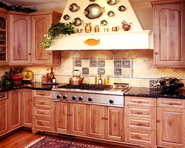 | 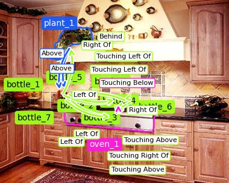 |

### 2. `2393507` (GQA)

**Question:** Is the refrigerator to the left or to the right of the stove on the left side?
**Gold:** The refrigerator is to the right of the stove., right

| condition | model output |
|---|---|
| raw (clean image) | **right** ✅ |
| segmented (masks only) | right |
| gom_text_labeled (full GoM: IDs + arrows + relation labels) | **left** ❌ |

*Mechanism:* direct left/right question answered wrong with arrows present — the graph relation contradicts the image

| original | full-GoM render (what the model saw) |
|---|---|
| 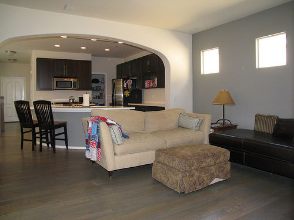 | 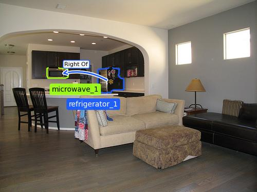 |

### 3. `392` (GQA)

**Question:** Is the keyboard to the left of the computer?
**Gold:** Yes, the keyboard is to the left of the computer., yes

| condition | model output |
|---|---|
| raw (clean image) | **Yes** ✅ |
| segmented (masks only) | No |
| gom_text_labeled (full GoM: IDs + arrows + relation labels) | **No** ❌ |

*Mechanism:* the 'computer' (desktop monitors) was never detected; arrows relate laptop and keyboards instead

| original | full-GoM render (what the model saw) |
|---|---|
| 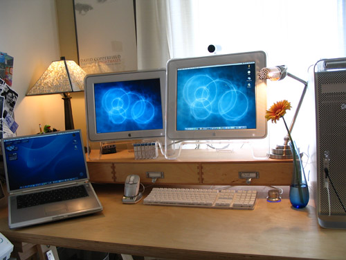 | 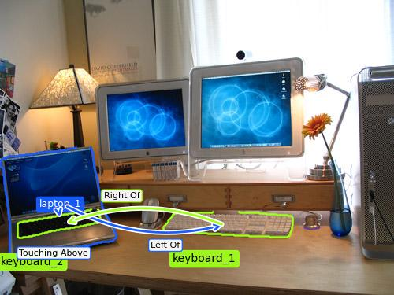 |

### 4. `2333988` (GQA)

**Question:** Who is wearing a jacket?
**Gold:** The woman is wearing a jacket., woman

| condition | model output |
|---|---|
| raw (clean image) | **woman** ✅ |
| segmented (masks only) | Everyone |
| gom_text_labeled (full GoM: IDs + arrows + relation labels) | **person 1** ❌ |

*Mechanism:* ID leakage: the model answers with the mark label 'person 1' instead of 'woman'

| original | full-GoM render (what the model saw) |
|---|---|
| 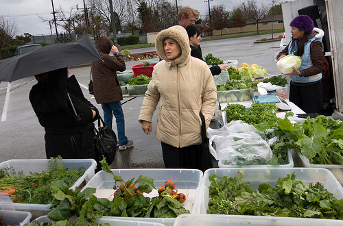 | 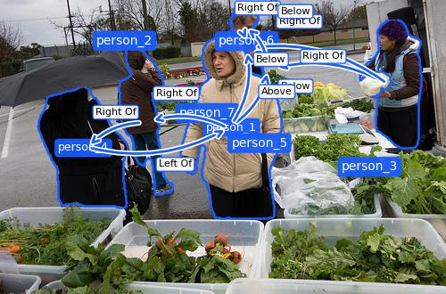 |

### 5. `2359506` (GQA)

**Question:** That snow is where?
**Gold:** The snow is on the ground., ground

| condition | model output |
|---|---|
| raw (clean image) | **ground** ✅ |
| segmented (masks only) | ground |
| gom_text_labeled (full GoM: IDs + arrows + relation labels) | **Below** ❌ |

*Mechanism:* relation-vocabulary leakage: answers 'Below' (arrow-label vocabulary) instead of 'ground'

| original | full-GoM render (what the model saw) |
|---|---|
|  | 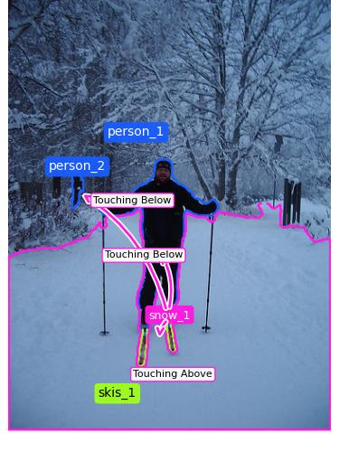 |

### 6. `2412283` (GQA)

**Question:** Is the bookcase to the left of the chair that is not antique?
**Gold:** Yes, the bookcase is to the left of the chair., yes

| condition | model output |
|---|---|
| raw (clean image) | **Yes** ✅ |
| segmented (masks only) | Yes |
| gom_text_labeled (full GoM: IDs + arrows + relation labels) | **No** ❌ |

*Mechanism:* yes→no denial on a spatial question with arrows present

| original | full-GoM render (what the model saw) |
|---|---|
|  | 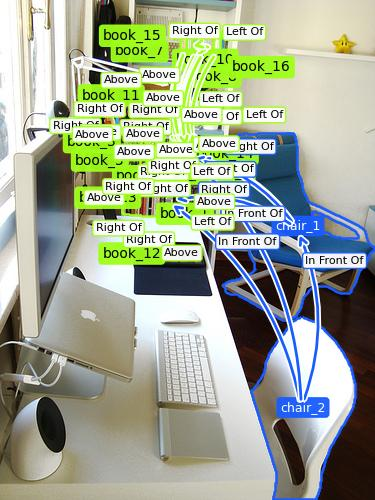 |

### 7. `2411991` (GQA)

**Question:** Do you see skiers to the left of the bag in the center?
**Gold:** Yes, there is a skier to the left of the backpack., yes

| condition | model output |
|---|---|
| raw (clean image) | **yes** ✅ |
| segmented (masks only) | Yes |
| gom_text_labeled (full GoM: IDs + arrows + relation labels) | **No** ❌ |

*Mechanism:* yes→no denial: skiers to the left of the bag

| original | full-GoM render (what the model saw) |
|---|---|
| 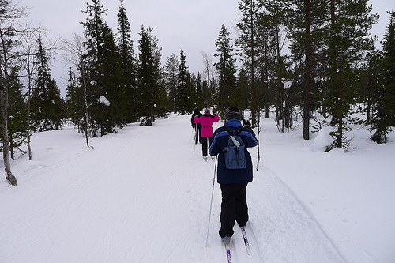 | 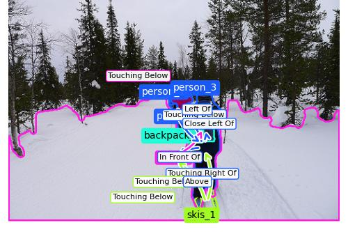 |

### 8. `2401706` (GQA)

**Question:** What kind of animal is to the left of the zebra that is eating grass?
**Gold:** The animal is a cow., cow

| condition | model output |
|---|---|
| raw (clean image) | **cow** ✅ |
| segmented (masks only) | cow |
| gom_text_labeled (full GoM: IDs + arrows + relation labels) | **horse** ❌ |

*Mechanism:* identity swap under marks on a relational question (cow → horse)

| original | full-GoM render (what the model saw) |
|---|---|
|  | 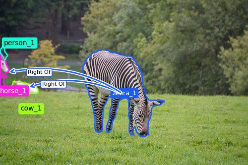 |

## Rescues: raw wrong → full GoM right (what wins look like)

### 9. `2409420` (GQA)

**Question:** Are there soft drinks to the left of the fork?
**Gold:** Yes, there is a soft drink to the left of the fork., yes

| condition | model output |
|---|---|
| raw (clean image) | **no** ❌ |
| segmented (masks only) | Yes |
| gom_text_labeled (full GoM: IDs + arrows + relation labels) | **Yes** ✅ |

*Mechanism:* the arrow genuinely corrects the model: soft drinks left of the fork

| original | full-GoM render (what the model saw) |
|---|---|
| 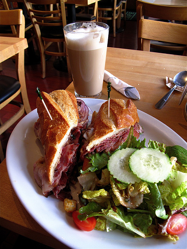 | 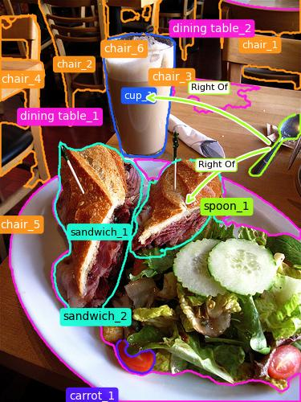 |

### 10. `2394743` (GQA)

**Question:** Is the church behind the sign?
**Gold:** Yes, the church is behind the sign., yes

| condition | model output |
|---|---|
| raw (clean image) | **No** ❌ |
| segmented (masks only) | No |
| gom_text_labeled (full GoM: IDs + arrows + relation labels) | **Yes** ✅ |

*Mechanism:* depth relation (behind) corrected by the graph

| original | full-GoM render (what the model saw) |
|---|---|
| 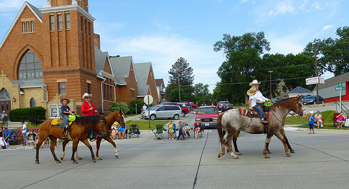 | 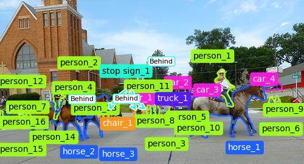 |

### 11. `2316312` (GQA)

**Question:** What is the vegetable to the right of the chair the woman is in?
**Gold:** The vegetable is lettuce., lettuce

| condition | model output |
|---|---|
| raw (clean image) | **potato** ❌ |
| segmented (masks only) | lettuce |
| gom_text_labeled (full GoM: IDs + arrows + relation labels) | **lettuce** ✅ |

*Mechanism:* relational identity corrected (potato → lettuce)

| original | full-GoM render (what the model saw) |
|---|---|
| 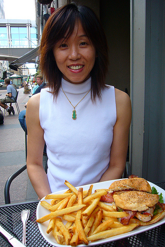 | 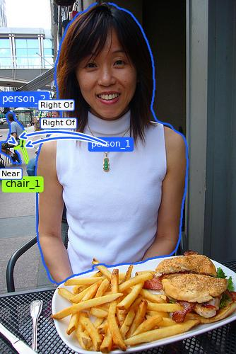 |

## The paper's declared fill vs the outline used above (same instance, `392`)

| paper profile (0.25 fill, data_v2) | best config (outline, data_v3) |
|---|---|
| 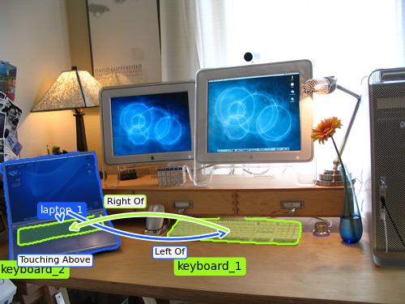 |  |

## Note on segmentation precision

The masks shown are SAM-HQ ViT-H output — the paper's declared segmenter (`sam_version:
hq`, weight hash verified at run time). Imprecise boundaries visible in these renders are
the pipeline's genuine behavior, not an evaluation artifact. Detection is the declared
OWLv2 + YOLOv8 + Detectron2 ensemble; objects missing from graphs (cases 1 and 3) are
detector misses that no render setting can repair.